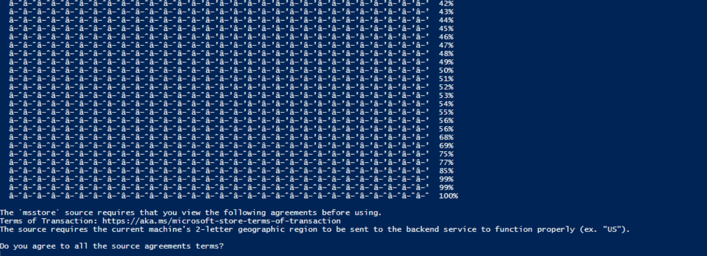

# Verslag: SUBJECT

> Naam verslaggever: Nathan De Gieter

## Beschrijving

In deze opdracht moesten we leren werken met een package manager. We moesten software installeren via powershell. Het doel was om te begrijpen hoe package managers werken.

## Antwoorden op de vragen in de opdracht

### Vraag 1 - De PowerShell-prompt toont de map waar we ons nu bevinden. Wat is de naam van deze directory?

`C:\WINDOWS\system32`

### Vraag 2 - In welke map heb je het script bewaard?

`C:\Users\degie\Documents\SEL_1\Installatie.ps1`  --> in de SEL_1 folder

### Vraag 3 - In welke map is het script bewaard in de screenshot onder stap 3?

`D:\Users\BertVV\Documents\HoGent\SELab\Installatie.ps1`  --> in de SELab folder

### WinGet – Belangrijke commando’s

| Taak                                    | Commando                |
|-----------------------------------------|-------------------------|
| Lijst tonen van geïnstalleerde software | `winget list`           |
| Alle packages updaten                   | `winget upgrade --all`  |
| Package zoeken                          | `winget search naam`    |
| Package verwijderen                     | `winget uninstall naam` |

**Voorbeeld:**

`winget search firefox`

`winget uninstall Mozilla.Firefox`

`winget search firefox`

`winget uninstall Mozilla.Firefox`

### Vraag 4 - Wat doen de opties -e en --id voor winget install?

 `--id` zorgt ervoor dat WinGet de applicatie installeert op basis van het **unieke package-ID** in plaats van de naam. Dit voorkomt fouten als er meerdere apps met dezelfde naam bestaan.
 `-e` betekent **exact match**. WinGet zoekt dan alleen een package dat exact overeenkomt met het opgegeven ID.

Samen zorgen deze opties ervoor dat de juiste software wordt geïnstalleerd zonder verwarring.

# Id's van verschillende applicaties

 Automatiseren software-installatie

`winget install -e --id Adobe.Acrobat.Reader.64-bit`

`winget install -e --id Mozilla.Firefox`

`winget install -e --id GitHub.GitHubDesktop`

`winget install -e --id Microsoft.VisualStudioCode`

`winget install -e --id VideoLAN.VLC`

## Evaluatiecriteria

* [x] Je hebt een package manager voor jouw besturingssysteem geïnstalleerd.
* [x] Je hebt een script (PowerShell of Bash) geschreven en gebruikt om de opgesomde applicaties te installeren.
* [] Je toont inzicht in de werking van een package manager en kan deze gebruiken voor basistaken.
* [x] Er is een verslag gemaakt op basis van het template.
* [] Elk teamlid heeft de eigen cheat sheet aangevuld met nuttige commando’s uit deze opdracht.
* [] Je hebt GitHub correct geconfigureerd op je toestel en je kent de basiscommando’s via CLI.
* [x] Er is een correct antwoord gegeven op de vragen die aangeduid zijn met een vraagteken.

## Problemen en oplossingen

### Probleem 1 - Onmogelijk om git te installeren, omdat ik de agreements niet kon aanvaarden.

input: `C:\Windows\system32> winget install git.git`

output: The `msstore` source requires that you view the following agreements before using.
Terms of Transaction: https://aka.ms/microsoft-store-terms-of-transaction
The source requires the current machine's 2-letter geographic region to be sent to the backend service to function properly (ex. "US").

Do you agree to all the source agreements terms?

Snel opgelost dankzij het commando `Set-ExecutionPolicy Bypass -Scope Process`

